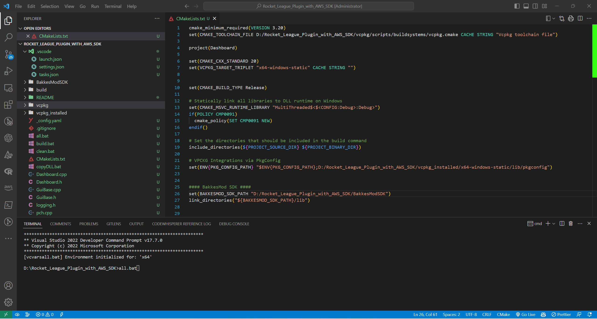
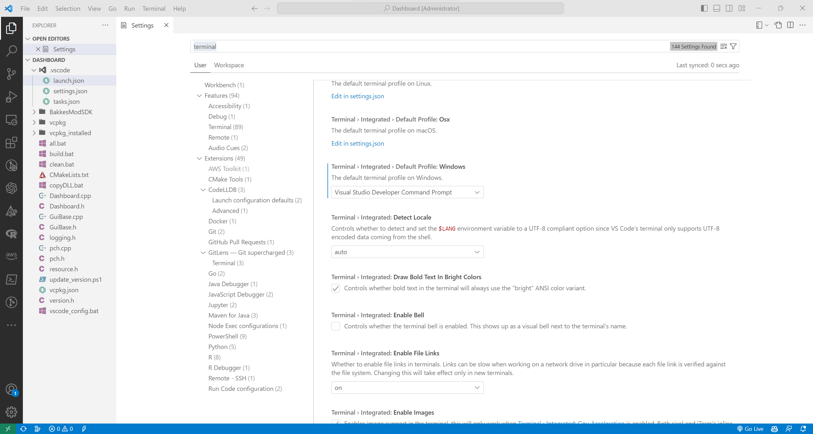

# **Rocket League Plugin Setup with AWS C++ SDK**

(using msvc compiler, dynamic C runtime with static libraries,"Release" build, VS Code Developer Terminal)
  
## 1. Build AWS SDK with VCPKG in Manifest Mode

```bash
mkdir Rocket_League_Plugin_with_AWS_SDK

```

(vcpkg.json placed in project root directory)

```json
{
"name": "dashboard-aws",
"version-string": "1.0.0",
"dependencies": [
   {
    "name": "aws-sdk-cpp",
    "default-features": false,
    "features": [
       "s3-crt",
       "dynamodb",
       "sts",
       "s3"
     ]
},
{
"name": "zlib"
},
{
"name": "libpng"
},
{
"name": "protobuf"
},
{
"name": "tiff"
},
{
"name": "fmt"
},
{
"name": "imgui"
},
{
"name": "nlohmann-json"
}
],
"builtin-baseline": "c9fa965c2a1b1334469b4539063f3ce95383653c"
}

```

```bash
cd Rocket_League_Plugin_with_AWS_SDK
git clone https://github.com/Microsoft/vcpkg.git
cd vcpkg && bootstrap-vcpkg.bat
vcpkg x-update-baseline --add-initial-baseline
vcpkg install --triplet x64-windows-static
vcpkg integrate install (Update your CMake file based on output from this command)

```

You may have to update folder permissions through windows explorer settings by
removing 'read only' attribute.
  
</br>

## 2. Install BakkesModSDK

```bash
cd ..
git clone https://github.com/bakkesmodorg/BakkesModSDK.git

```

</br>

## 3. Create a Visual Studio Code Solution for Your DLL

- Create a new DLL project in Visual Studio Code
- copy launch.json, settings.json, tasks.json
- update settings/configuration as appropriate
- run vscode\_config.bat one time to update permissions and move files to .vscode directory
- Replace Dashboard.cpp and Dashboard.h with your actual plugin files
  
</br>

## 4. Update Build Settings as Needed

- Update CMake file from 'vcpkg integrate install' command
- Update build.bat with location of vcpkg CMake toolchain
- Update copyDLL.bat for where to save your final DLL

</br>

## 5. CMake Build File

```bash  
cmake_minimum_required(VERSION 3.20)

set(CMAKE_TOOLCHAIN_FILE D:/Rocket_League_Plugin_with_AWS_SDK/vcpkg/scripts/buildsystems/vcpkg.cmake
  CACHE STRING "Vcpkg toolchain file")

project(Dashboard)

set(CMAKE_CXX_STANDARD 20)
set(VCPKG_TARGET_TRIPLET "x64-windows-static" CACHE STRING "")
set(CMAKE_BUILD_TYPE Release)

#Statically link all libraries to DLL runtime on Windows
set(CMAKE_MSVC_RUNTIME_LIBRARY "MultiThreaded$<$<CONFIG:Debug>:Debug>")

if(POLICY CMP0091)
cmake_policy(SET CMP0091 NEW)
endif()

#Set the directories that should be included in the build command
include_directories(${PROJECT_SOURCE_DIR} ${PROJECT_BINARY_DIR})

#VPCKG Integrations via PkgConfig
set(ENV{PKG_CONFIG_PATH} "$ENV{PKG_CONFIG_PATH};D:/Rocket_League_Plugin_with_AWS_SDK/vcpkg_installed/x64-windows-static/lib/pkgconfig")

#### BakkesMod SDK ####
set(BAKKESMOD_SDK_PATH "D:/Rocket_League_Plugin_with_AWS_SDK/BakkesModSDK")
link_directories("${BAKKESMOD_SDK_PATH}/lib")

#### AWS VCPKG Libraries (vcpkg.json) ####
set(TIFF_LIBRARIES ${_VCPKG_INSTALLED_DIR}/${VCPKG_TARGET_TRIPLET}/lib/tiff.lib)
find_package(AWSSDK CONFIG COMPONENTS core dynamodb REQUIRED)
find_package(ZLIB REQUIRED)
find_package(PNG REQUIRED)
find_package(protobuf REQUIRED)

#### BakkesMod VCPKG Libraries (vcpkg.json) ####
find_package(imgui REQUIRED)
find_package(fmt REQUIRED)

#### NLOHMANN JSON VCPKG Library (vcpkg.json) ####
find_package(nlohmann_json CONFIG REQUIRED)

#The main plugin file
set(SOURCE_FILES Dashboard.cpp)

#Create DLL
add_library(${PROJECT_NAME} SHARED ${SOURCE_FILES})

set_target_properties(${PROJECT_NAME} PROPERTIES
LIBRARY_OUTPUT_DIRECTORY "${CMAKE_CURRENT_SOURCE_DIR}/bin")

#Include directories
target_include_directories(
   ${PROJECT_NAME} PRIVATE
   ${BAKKESMOD_SDK_PATH}/include
   ${AWSSDK_INCLUDE_DIRS}
   ${TIFF_INCLUDE_DIRS}
   ${nlohmann_json_INCLUDE_DIRS}
)

#Link static libraries to DLL
target_link_libraries(
   ${PROJECT_NAME}
   pluginsdk
   ${AWSSDK_LIBRARIES}
   ${TIFF_LIBRARIES}
   ZLIB::ZLIB
   PNG::PNG
   protobuf::libprotobuf-lite
   imgui::imgui
   fmt::fmt-header-only
   nlohmann_json::nlohmann_json
)

#Bundle system runtime libraries into DLL
include(InstallRequiredSystemLibraries)
install(FILES ${CMAKE_INSTALL_SYSTEM_RUNTIME_LIBS} DESTINATION "${CMAKE_CURRENT_SOURCE_DIR}/bin")

```

</br>

## 6. Build Project from VS Code Developer Terminal

- Run all.bat (clean.bat (removes build directory), build.bat (runs CMake file), copyDLL.bat (saves DLL to Bakkesmod plugin  directory or wherever else you like)



</br>

## 7. Bakkesmod Log Plugin Output

```log

[10:45:42] [bakkesmod] > plugin load dashboard
[10:45:42] [bakkesmod] Trying LoadLibraryW
[10:45:42] [bakkesmod] On file: C:\Users\jerom\AppData\Roaming\bakkesmod\bakkesmod\plugins/dashboard.dll. 
[10:45:42] [bakkesmod] Called LoadLibraryW 
[10:45:42] [bakkesmod] Plugin Info: 
[10:45:42] [bakkesmod] API Version: 95
[10:45:42] [bakkesmod] File Name: D:\Rocket_League_Plugin_with_AWS_SDK\Dashboard.cpp
[10:45:42] [bakkesmod] Class Name: Dashboard
[10:45:42] [bakkesmod] Plugin Name: Rocket League Game Dashboard
[10:45:42] [bakkesmod] Game events: 1
[10:45:42] [bakkesmod] Plugin Version: 1.0
[10:45:42] [bakkesmod] [class Dashboard] Dashboard plugin started..
[10:45:42] [bakkesmod] Plugin dashboard loaded successfully.
[10:46:03] [bakkesmod] > closemenu queuemenu
[10:46:03] [bakkesmod] Window queuemenu is already closed.
[10:46:03] [bakkesmod] > closemenu queuemenu
[10:46:03] [bakkesmod] Window queuemenu is already closed.
[10:46:05] [RankShowMod] New game event set
[10:46:05] [bakkesmod] [class Dashboard] Your DynamoDB tables:
[10:46:05] [bakkesmod] [class Dashboard] rocket_league_continuous_events
[10:46:05] [bakkesmod] [class Dashboard] rocket_league_discrete_events
[10:46:05] [RankShowMod] New game event set

```  

 </br>

## Notes

- choco install ninja (Generator)

- Configure VS Code Developer Terminal as Default [[https://code.visualstudio.com/docs/cpp/config-msvc#_run-vs-code-outside-the-developer-command-prompt]](https://code.visualstudio.com/docs/cpp/config-msvc#_run-vs-code-outside-the-developer-command-prompt)


